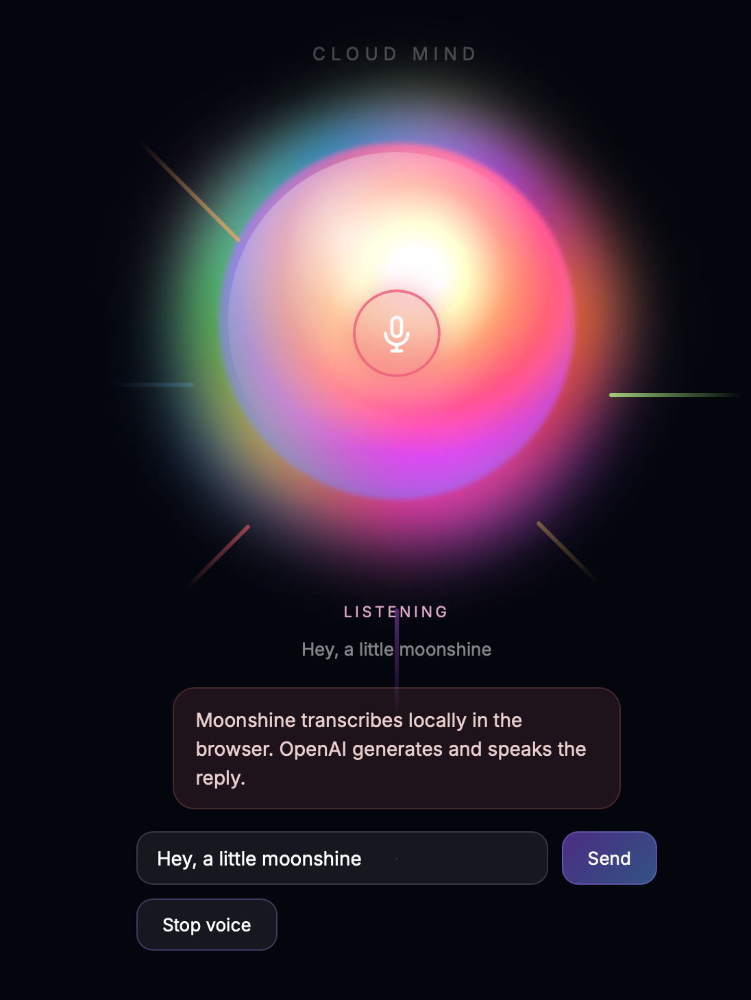

# Chatty Voice Agent



A small Node.js app that opens a local website for voice chat.

- Speech-to-text supports MoonshineJS in the browser.
- OpenAI real-time mode uses Realtime transcription plus server VAD.
- The assistant reply is generated with the OpenAI Chat Completions API.
- Text-to-speech uses the OpenAI speech API and plays the answer back in the browser.

## Setup

1. Install dependencies:

   ```bash
   npm install
   ```

2. Copy the env template and add your API key:

   ```bash
   cp .env.example .env
   ```

3. Start the server:

   ```bash
   npm run dev
   ```

4. Open `http://localhost:3005`.

## Notes

- `Mode: Real-time free speech` with `STT: gpt-4o-mini-transcribe` uses OpenAI Realtime transcription over WebRTC with VAD.
- `Mode: Push to talk` with `STT: gpt-4o-mini-transcribe` uses chunked transcription uploads on release.
- The first Moonshine start can take a few seconds while the browser downloads and initializes the local STT model.
- If you want shorter or longer answers, change `SYSTEM_PROMPT` in `.env`.
